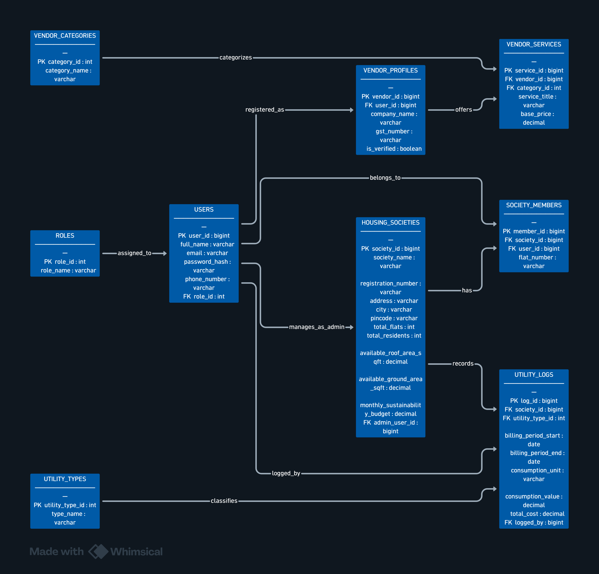

# EcoSocietyAI Database Documentation

Welcome to the **EcoSocietyAI** database schema documentation. This database is designed to power a smart sustainability and management platform for housing societies. It enables societies to track utility consumption, manage environmental budgets, allocate space for green initiatives (such as solar panels and rainwater harvesting), and connect with verified service vendors.

---

## 📊 Entity-Relationship (ER) Diagram

The following diagram shows the relationships, primary keys, and foreign keys between the tables:



---

## 🗂️ Table Schema Definitions

### 1. `ROLES`

Defines the different access levels and roles inside the application (e.g., Super Admin, Society Admin, Society Member, Vendor).

| Column Name | Data Type |  Key   | Description                                           |
| :---------- | :-------- | :----: | :---------------------------------------------------- |
| `role_id`   | `int`     | **PK** | Unique identifier for each role.                      |
| `role_name` | `varchar` |        | Name of the role (e.g., 'Admin', 'Member', 'Vendor'). |

---

### 2. `USERS`

Stores the central authentication and profile details for all platform users.

| Column Name     | Data Type |  Key   | Description                                                |
| :-------------- | :-------- | :----: | :--------------------------------------------------------- |
| `user_id`       | `bigint`  | **PK** | Unique identifier for the user.                            |
| `full_name`     | `varchar` |        | The user's full name.                                      |
| `email`         | `varchar` |        | Email address (used as unique login credential).           |
| `password_hash` | `varchar` |        | Securely hashed password.                                  |
| `phone_number`  | `varchar` |        | Contact telephone number.                                  |
| `role_id`       | `int`     | **FK** | Reference to `ROLES.role_id` determining user permissions. |

---

### 3. `VENDOR_CATEGORIES`

Categorizes the services offered by vendors (e.g., Solar Installation, Waste Management, Rainwater Harvesting).

| Column Name     | Data Type |  Key   | Description                         |
| :-------------- | :-------- | :----: | :---------------------------------- |
| `category_id`   | `int`     | **PK** | Unique identifier for the category. |
| `category_name` | `varchar` |        | The category display name.          |

---

### 4. `VENDOR_PROFILES`

Contains professional details for users registered as service providers.

| Column Name    | Data Type |  Key   | Description                                                         |
| :------------- | :-------- | :----: | :------------------------------------------------------------------ |
| `vendor_id`    | `bigint`  | **PK** | Unique identifier for the vendor profile.                           |
| `user_id`      | `bigint`  | **FK** | Reference to `USERS.user_id` associated with this business profile. |
| `company_name` | `varchar` |        | Registered name of the company/vendor.                              |
| `gst_number`   | `varchar` |        | Tax registration identifier (GSTIN).                                |
| `is_verified`  | `boolean` |        | Verification badge status (managed by system admins).               |

---

### 5. `VENDOR_SERVICES`

Lists the sustainability and green energy services offered by vendors.

| Column Name     | Data Type |  Key   | Description                                                   |
| :-------------- | :-------- | :----: | :------------------------------------------------------------ |
| `service_id`    | `bigint`  | **PK** | Unique identifier for the service.                            |
| `vendor_id`     | `bigint`  | **FK** | Reference to `VENDOR_PROFILES.vendor_id`.                     |
| `category_id`   | `int`     | **FK** | Reference to `VENDOR_CATEGORIES.category_id`.                 |
| `service_title` | `varchar` |        | Name of the service offered (e.g., '5kW Solar Installation'). |
| `base_price`    | `decimal` |        | Initial or starting cost for the service.                     |

---

### 6. `HOUSING_SOCIETIES`

Stores information about registered housing societies, including their resource capacities and sustainability budgets.

| Column Name                     | Data Type |  Key   | Description                                                                 |
| :------------------------------ | :-------- | :----: | :-------------------------------------------------------------------------- |
| `society_id`                    | `bigint`  | **PK** | Unique identifier for the housing society.                                  |
| `society_name`                  | `varchar` |        | Name of the housing society.                                                |
| `registration_number`           | `varchar` |        | Legal registration ID of the society.                                       |
| `address`                       | `varchar` |        | Physical address.                                                           |
| `city`                          | `varchar` |        | City.                                                                       |
| `pincode`                       | `varchar` |        | Postal/Zip code.                                                            |
| `total_flats`                   | `int`     |        | Total number of apartments/flats in the society.                            |
| `total_residents`               | `int`     |        | Current resident population.                                                |
| `available_roof_area_sqft`      | `decimal` |        | Space available on rooftops for solar panels/greenhouses (sq. ft.).         |
| `available_ground_area_sqft`    | `decimal` |        | Ground space available for setups like rainwater harvesting (sq. ft.).      |
| `monthly_sustainability_budget` | `decimal` |        | Allocated monthly funds reserved for green and eco-friendly projects.       |
| `admin_user_id`                 | `bigint`  | **FK** | Reference to `USERS.user_id` designating the manager/admin of this society. |

---

### 7. `SOCIETY_MEMBERS`

Maps users to the housing societies they reside in.

| Column Name   | Data Type |  Key   | Description                                     |
| :------------ | :-------- | :----: | :---------------------------------------------- |
| `member_id`   | `bigint`  | **PK** | Unique identifier for the membership record.    |
| `society_id`  | `bigint`  | **FK** | Reference to `HOUSING_SOCIETIES.society_id`.    |
| `user_id`     | `bigint`  | **FK** | Reference to `USERS.user_id`.                   |
| `flat_number` | `varchar` |        | Apartment or block designation (e.g., 'A-402'). |

---

### 8. `UTILITY_TYPES`

Defines categories of utilities tracked by the societies (e.g., Electricity, Water, Waste, Gas).

| Column Name       | Data Type |  Key   | Description                             |
| :---------------- | :-------- | :----: | :-------------------------------------- |
| `utility_type_id` | `int`     | **PK** | Unique identifier for the utility type. |
| `type_name`       | `varchar` |        | The name of the utility type.           |

---

### 9. `UTILITY_LOGS`

Tracks resource consumption metrics over time for auditing and analysis.

| Column Name            | Data Type |  Key   | Description                                                    |
| :--------------------- | :-------- | :----: | :------------------------------------------------------------- |
| `log_id`               | `bigint`  | **PK** | Unique identifier for the log entry.                           |
| `society_id`           | `bigint`  | **FK** | Reference to `HOUSING_SOCIETIES.society_id`.                   |
| `utility_type_id`      | `int`     | **FK** | Reference to `UTILITY_TYPES.utility_type_id`.                  |
| `billing_period_start` | `date`    |        | Start date of the recorded cycle.                              |
| `billing_period_end`   | `date`    |        | End date of the recorded cycle.                                |
| `consumption_unit`     | `varchar` |        | Units measured (e.g., 'kWh', 'Litres', 'kg').                  |
| `consumption_value`    | `decimal` |        | Numerical quantity consumed.                                   |
| `total_cost`           | `decimal` |        | Invoice/utility cost for this period.                          |
| `logged_by`            | `bigint`  | **FK** | Reference to `USERS.user_id` signifying who recorded this log. |

---

## 🔗 Key Database Flows

### 🛡️ Role-Based Access Control (RBAC)

Every account in `USERS` points to a single role in `ROLES`.

- **Society Admins** have their `user_id` mapped to `HOUSING_SOCIETIES.admin_user_id` so they can edit society statistics, sustainability budgets, and log resource consumption.
- **Regular Members** are mapped to their society in the `SOCIETY_MEMBERS` link table, allowing them to view utility statistics and localized reports.
- **Vendors** require an entry in the `VENDOR_PROFILES` table.

### 🌿 Sustainability & Space Asset Management

The fields `available_roof_area_sqft` and `available_ground_area_sqft` in the `HOUSING_SOCIETIES` table are used to calculate feasibility metrics for green solutions. For instance, solar service companies can scan the registry to suggest appropriately sized solar plants based on the society's roof area.

### 💰 Sustainability Budget & Service Discovery

The `monthly_sustainability_budget` column defines how much money the society commits to ecological operations. When combined with the `base_price` of vendor packages (`VENDOR_SERVICES`), the platform can automatically recommend affordable services (e.g., waste composting contracts or water filtration maintenance).

---

## 🛠️ SQL DDL Script

Below is the standard DDL script to create the tables with their constraints:

```sql
-- 1. ROLES & USERS SCHEMA
CREATE TABLE roles (
    role_id INT AUTO_INCREMENT PRIMARY KEY,
    role_name VARCHAR(50) NOT NULL UNIQUE
);

INSERT INTO roles (role_name) VALUES
('ROLE_ADMIN'),
('ROLE_MEMBER'),
('ROLE_GUEST'),
('ROLE_VENDOR');

CREATE TABLE users (
    user_id BIGINT AUTO_INCREMENT PRIMARY KEY,
    full_name VARCHAR(100) NOT NULL,
    email VARCHAR(150) NOT NULL UNIQUE,
    password_hash VARCHAR(255) NOT NULL,
    phone_number VARCHAR(15),
    role_id INT NOT NULL,
    created_at TIMESTAMP DEFAULT CURRENT_TIMESTAMP,
    FOREIGN KEY (role_id) REFERENCES roles(role_id)
);

-- 2. HOUSING SOCIETY DEMOGRAPHICS SCHEMA
CREATE TABLE housing_societies (
    society_id BIGINT AUTO_INCREMENT PRIMARY KEY,
    society_name VARCHAR(150) NOT NULL,
    registration_number VARCHAR(50) UNIQUE NOT NULL,
    address TEXT NOT NULL,
    city VARCHAR(50) NOT NULL,
    pincode VARCHAR(10) NOT NULL,
    total_flats INT NOT NULL,
    total_residents INT NOT NULL,
    built_up_area_sqft DECIMAL(10, 2),
    available_roof_area_sqft DECIMAL(10, 2) NOT NULL,
    available_ground_area_sqft DECIMAL(10, 2) NOT NULL,
    monthly_sustainability_budget DECIMAL(12, 2) DEFAULT 0.00,
    admin_user_id BIGINT NOT NULL,
    created_at TIMESTAMP DEFAULT CURRENT_TIMESTAMP,
    FOREIGN KEY (admin_user_id) REFERENCES users(user_id)
);

CREATE TABLE society_members (
    member_id BIGINT AUTO_INCREMENT PRIMARY KEY,
    society_id BIGINT NOT NULL,
    user_id BIGINT NOT NULL,
    flat_number VARCHAR(20) NOT NULL,
    FOREIGN KEY (society_id) REFERENCES housing_societies(society_id) ON DELETE CASCADE,
    FOREIGN KEY (user_id) REFERENCES users(user_id) ON DELETE CASCADE
);

-- 3. UTILITIES & RESOURCE LOGGING SCHEMA
CREATE TABLE utility_types (
    utility_type_id INT AUTO_INCREMENT PRIMARY KEY,
    type_name VARCHAR(50) NOT NULL UNIQUE -- e.g., 'ENERGY', 'WATER', 'WASTE'
);

INSERT INTO utility_types (type_name) VALUES ('ENERGY'), ('WATER'), ('WASTE');

CREATE TABLE utility_logs (
    log_id BIGINT AUTO_INCREMENT PRIMARY KEY,
    society_id BIGINT NOT NULL,
    utility_type_id INT NOT NULL,
    billing_period_start DATE NOT NULL,
    billing_period_end DATE NOT NULL,
    consumption_unit VARCHAR(20) NOT NULL, -- e.g., 'kWh', 'Liters', 'Kg'
    consumption_value DECIMAL(12, 2) NOT NULL,
    total_cost DECIMAL(10, 2) NOT NULL,
    bill_document_url VARCHAR(255),
    logged_by BIGINT NOT NULL,
    logged_at TIMESTAMP DEFAULT CURRENT_TIMESTAMP,
    FOREIGN KEY (society_id) REFERENCES housing_societies(society_id) ON DELETE CASCADE,
    FOREIGN KEY (utility_type_id) REFERENCES utility_types(utility_type_id),
    FOREIGN KEY (logged_by) REFERENCES users(user_id)
);

-- 4. GREEN VENDOR MARKETPLACE SCHEMA
CREATE TABLE vendor_categories (
    category_id INT AUTO_INCREMENT PRIMARY KEY,
    category_name VARCHAR(100) NOT NULL UNIQUE -- e.g., 'Solar', 'EV Charging', 'Rainwater Harvesting', 'Waste Management'
);

INSERT INTO vendor_categories (category_name) VALUES
('Solar Panel Installation'),
('EV Charging Infrastructure'),
('Rainwater Harvesting'),
('Organic Waste Disposal');

CREATE TABLE vendor_profiles (
    vendor_id BIGINT AUTO_INCREMENT PRIMARY KEY,
    user_id BIGINT NOT NULL UNIQUE,
    company_name VARCHAR(150) NOT NULL,
    gst_number VARCHAR(20) UNIQUE NOT NULL,
    contact_email VARCHAR(150) NOT NULL,
    contact_phone VARCHAR(15) NOT NULL,
    is_verified BOOLEAN DEFAULT FALSE,
    FOREIGN KEY (user_id) REFERENCES users(user_id) ON DELETE CASCADE
);

CREATE TABLE vendor_services (
    service_id BIGINT AUTO_INCREMENT PRIMARY KEY,
    vendor_id BIGINT NOT NULL,
    category_id INT NOT NULL,
    service_title VARCHAR(150) NOT NULL,
    description TEXT,
    base_price DECIMAL(10, 2) NOT NULL,
    capacity_unit VARCHAR(30), -- e.g., 'per kW', 'per charger port'
    FOREIGN KEY (vendor_id) REFERENCES vendor_profiles(vendor_id) ON DELETE CASCADE,
    FOREIGN KEY (category_id) REFERENCES vendor_categories(category_id)
);
```
